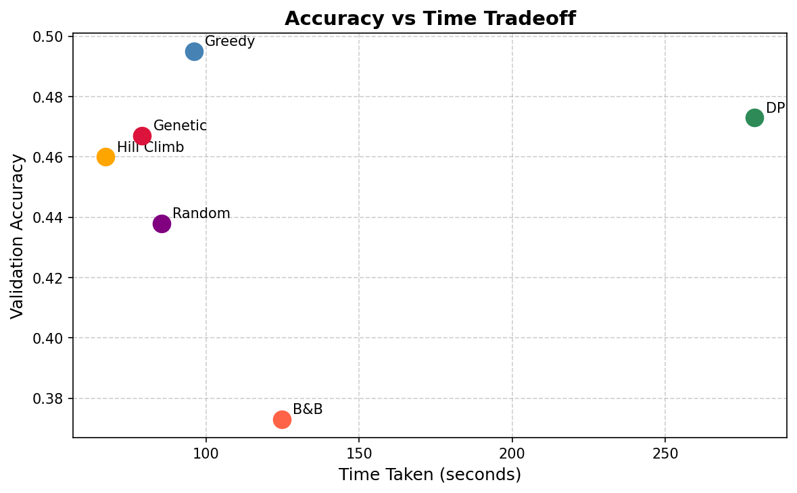
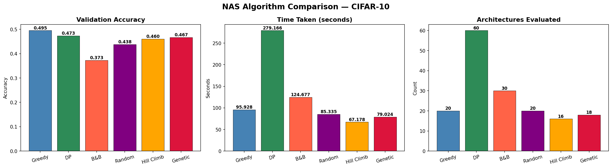

 ##Neural Architecture Search Optimization (DAA Project)

##  Overview

Neural Architecture Search (NAS) is a technique used to automatically design optimal neural network architectures.
This project focuses on improving NAS efficiency using various **Design and Analysis of Algorithms (DAA)** optimization techniques.

Instead of manually designing models, we apply algorithmic strategies to explore the search space efficiently and find the best architecture.


##  Objectives

* Automate neural network architecture design
* Apply DAA optimization algorithms to improve search efficiency
* Compare performance of different algorithms
* Analyze accuracy vs computation time

##  Tech Stack

* **Programming Language:** Python
* **Platform:** Google Colab
* **Libraries Used:**

  * NumPy
  * PyTorch
  * Matplotlib
  * Scikit-learn

##  Algorithms Used

The following optimization algorithms were implemented:

1. **Genetic Algorithm**

   * Mimics natural selection
   * Uses mutation and crossover to evolve architectures

2. **Simulated Annealing**

   * Inspired by annealing process in metallurgy
   * Accepts worse solutions initially to escape local optima

3. **Hill Climbing**

   * Iteratively improves solution
   * May get stuck in local optimum

4. **Random Search**

   * Randomly samples architectures
   * Simple but sometimes effective

5. **Grid Search**

   * Exhaustive search over parameter space
   * Computationally expensive

6. **Bayesian Optimization**

   * Uses probability model to guide search
   * Efficient compared to brute-force methods
   * 
## Results

### Accuracy vs Time



### Algorithm Comparison



## Project Structure

```
NAS-Daa-Optimization/
│
├── notebooks/
│   └── Neural_Architecture_Search_DAA_Optimization.ipynb
│
├── models/
│   └── best_nas_model.pth
│
├── results/
│   ├── accuracy_vs_time.png
│   └── nas_comparison.png
│
├── README.md
└── requirements.txt

## How to Run

1. Open the notebook in **Google Colab**
2. Upload the dataset (if required)
3. Run all cells sequentially
4. Observe outputs and generated graphs
5. Best model will be saved in `models/`

---

## 📈 Observations

* Genetic Algorithm and Bayesian Optimization provided better results
* Grid Search was accurate but slow
* Random Search was fast but inconsistent
* Trade-off exists between accuracy and computation time

## Future Improvements

* Apply NAS on larger datasets
* Use deep reinforcement learning for search
* Optimize computational cost further
* Parallelize search algorithm

##  Conclusion

This project demonstrates how DAA concepts can be applied to optimize Neural Architecture Search.
By comparing multiple algorithms, we identify efficient strategies for searching optimal neural network architectures.


